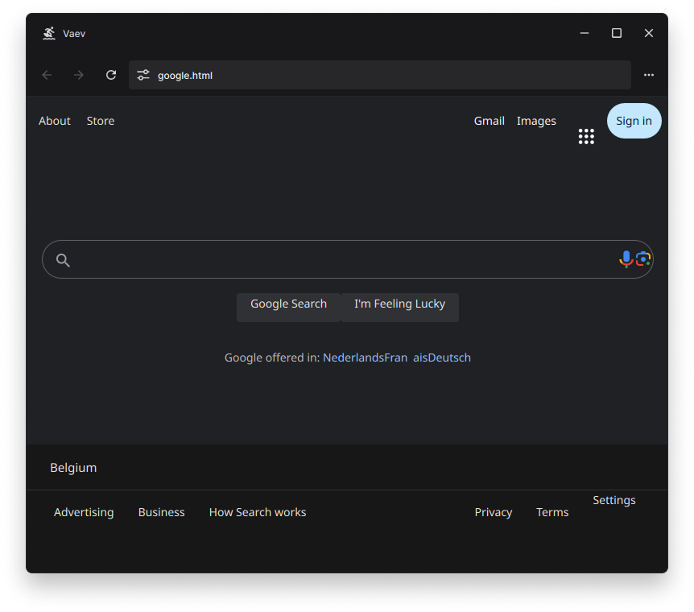

<br/>
<br/>
<br/>
<p align="center">
    
</p>
<p align="center">
    An experimental web browser engine
</p>
<br/>



## Features

Veav currently supports a subset of web standards, including:

- Most display types (excluding grid)
- Standard CSS cascade behavior
- Pagination using @page rules
- Print-to-PDF output
- All CSS units, including percentages, var(), and calc()
- Loading of HTML and XHTML documents
- Very basic networking, only `http://` and `file://` is supported

For detailed compatibility and feature tracking, see our [WPT status page](https://vaev-org.github.io/wpt-status/)

## Trying It Out

You can try out Veav by running the following command:

```bash
pacman -S base-devel git ninja sdl2 nasm gcc-multilib liburing clang libseccomp lld llvm jq

git clone https://github.com/skift-org/vaev.git

cd vaev

pip install git+https://github.com/cute-engineering/cutekit

python -m cutekit run --release vaev-browser -- file.html
```

## Architecture

An [architecture diagram](doc/diagrams.tldr) is available next to this file. It's in the tldraw format.

## Authors

 - [Lou !](https://github.com/Louciole)
 - [LuneMercier](https://github.com/LuneMercier)
 - [Paulo Medeiros](https://github.com/pauloamed)
 - [Sleepy Monax](https://github.com/sleepy-monax)
